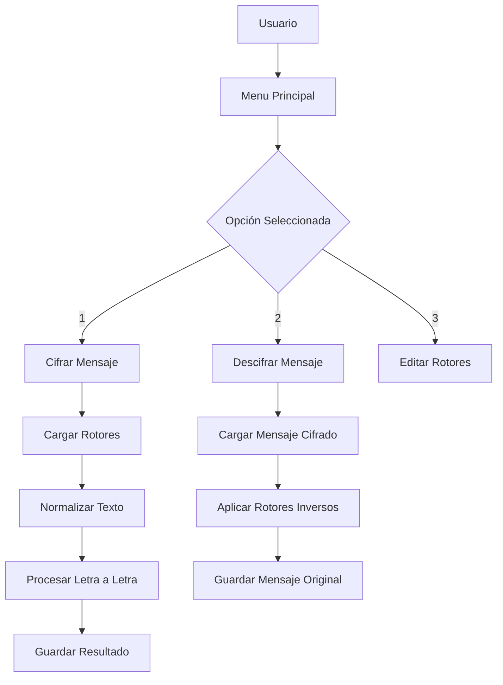

# Implementación de la Máquina Enigma en C++
## Análisis y Documentación Técnica de un Simulador Criptográfico

**Autores:** Victor Belmonte -  Pol Fajardo  
**Curso:** Programación en C++  
**Fecha:** Mayo 2025

---

## Tabla de Contenidos

1. [Introducción](#1-introducción)
   1.1 [Contexto Histórico](#11-contexto-histórico)
   1.2 [Objetivos del Proyecto](#12-objetivos-del-proyecto)
   1.3 [Alcance y Limitaciones](#13-alcance-y-limitaciones)

2. [Fundamentos Teóricos](#2-fundamentos-teóricos)
   2.1 [Principios de la Máquina Enigma](#21-principios-de-la-máquina-enigma)
   2.2 [Criptografía de Sustitución](#22-criptografía-de-sustitución)
   2.3 [Mecánica de Rotores](#23-mecánica-de-rotores)

3. [Arquitectura del Sistema](#3-arquitectura-del-sistema)
   3.1 [Diseño Modular](#31-diseño-modular)
   3.2 [Estructura de Archivos](#32-estructura-de-archivos)
   3.3 [Flujo de Datos](#33-flujo-de-datos)

4. [Implementación Técnica](#4-implementación-técnica)
   4.1 [Gestión de Rotores](#41-gestión-de-rotores)
   4.2 [Algoritmo de Cifrado](#42-algoritmo-de-cifrado)
   4.3 [Proceso de Descifrado](#43-proceso-de-descifrado)
   4.4 [Interfaz de Usuario](#44-interfaz-de-usuario)

5. [Análisis de Casos de Uso](#5-análisis-de-casos-de-uso)
   5.1 [Caso Simple: "HOLA MUNDO"](#51-caso-simple-hola-mundo)
   5.2 [Configuración de Rotores](#52-configuración-de-rotores)
   5.3 [Validación de Entrada](#53-validación-de-entrada)

6. [Optimizaciones y Características Avanzadas](#6-optimizaciones-y-características-avanzadas)
   6.1 [Manejo de Errores](#61-manejo-de-errores)
   6.2 [Validación de Permutaciones](#62-validación-de-permutaciones)
   6.3 [Formateo de Salida](#63-formateo-de-salida)

7. [Conclusiones y Trabajo Futuro](#7-conclusiones-y-trabajo-futuro)

---

## 1. Introducción

### 1.1 Contexto Histórico

La **máquina Enigma** fue un dispositivo de cifrado utilizado principalmente por las fuerzas armadas alemanas durante la Segunda Guerra Mundial. Desarrollada en los años 1920, esta máquina electromecánica implementaba un sistema de **cifrado polialfabético** mediante rotores giratorios que creaban sustituciones complejas del alfabeto.

> [!IMPORTANT]
> La complejidad criptográfica de Enigma residía en que cada letra se cifraba de manera diferente dependiendo de la posición de los rotores, generando más de 150 trillones de configuraciones posibles.

### 1.2 Objetivos del Proyecto

Este proyecto implementa una **simulación software** de la máquina Enigma con los siguientes objetivos:

- Recrear fielmente el mecanismo de cifrado/descifrado por rotores
- Proporcionar una interfaz interactiva para configuración y operación
- Demostrar principios fundamentales de criptografía clásica
- Implementar validación robusta de entrada y manejo de errores

### 1.3 Alcance y Limitaciones

| Característica | Implementado | Notas |
|----------------|--------------|-------|
| 3 Rotores configurables | ✅ | Con permutaciones personalizables |
| Sistema de notch | ✅ | Avance automático de rotores |
| Cifrado/Descifrado | ✅ | Proceso reversible completo |
| Reflector | ❌ | Simplificación del diseño original |
| Plugboard | ❌ | No implementado en esta versión |

---

## 2. Fundamentos Teóricos

### 2.1 Principios de la Máquina Enigma

La máquina Enigma opera bajo el principio de **sustitución polialfabética**, donde cada letra del mensaje se sustituye por otra letra según una transformación que cambia con cada carácter procesado.

> [!NOTE]
> A diferencia de los cifrados monoalfabéticos (como el cifrado César), donde 'A' siempre se cifra como la misma letra, en Enigma cada 'A' puede cifrarse como letras diferentes dependiendo de la posición de los rotores.

### 2.2 Criptografía de Sustitución

El proceso de cifrado sigue esta secuencia:

```
Letra Original → Rotor 1 → Rotor 2 → Rotor 3 → Letra Cifrada
```

Para el descifrado, el proceso se invierte:

```
Letra Cifrada → Rotor 3⁻¹ → Rotor 2⁻¹ → Rotor 1⁻¹ → Letra Original
```

### 2.3 Mecánica de Rotores

Cada rotor implementa una **permutación del alfabeto** de 26 letras. Los rotores avanzan según estas reglas:

1. **Rotor 1**: Avanza en cada letra procesada
2. **Rotor 2**: Avanza cuando Rotor 1 alcanza su posición de "notch"
3. **Rotor 3**: Avanza cuando Rotor 2 alcanza su posición de "notch"

> [!TIP]
> Esta mecánica escalonada crea patrones de cifrado extremadamente complejos, ya que la configuración completa de los tres rotores cambia de manera irregular.

---

## 3. Arquitectura del Sistema

### 3.1 Diseño Modular

El sistema está organizado en **cinco módulos principales**:

| Módulo | Responsabilidad | Archivos |
|--------|-----------------|----------|
| **Main** | Punto de entrada del programa | `main.cpp` |
| **Menu** | Interfaz de usuario e interacción | `menu.cpp`, `menu.h` |
| **Enigma** | Lógica de cifrado/descifrado | `enigma.cpp`, `enigma.h` |
| **Rotor** | Gestión y validación de rotores | `rotor.cpp`, `rotor.h` |
| **Constants** | Definiciones globales | `const.h` |

### 3.2 Estructura de Archivos

```
proyecto-enigma/
├── src/
│   ├── main.cpp          # Entrada principal
│   ├── menu.cpp/.h       # Interfaz de usuario
│   ├── enigma.cpp/.h     # Motor de cifrado
│   ├── rotor.cpp/.h      # Gestión de rotores
│   └── const.h           # Constantes globales
└── data/
    ├── Rotor1.txt        # Configuración rotor 1
    ├── Rotor2.txt        # Configuración rotor 2
    ├── Rotor3.txt        # Configuración rotor 3
    ├── Missatge.txt      # Mensaje a cifrar
    ├── Xifrat.txt        # Mensaje cifrado
    └── Desxifrat.txt     # Mensaje descifrado
```

### 3.3 Flujo de Datos



---

## 4. Implementación Técnica

### 4.1 Gestión de Rotores

#### 4.1.1 Estructura de un Rotor

Cada rotor se define mediante:
- **Permutación (wiring)**: String de 26 caracteres únicos A-Z
- **Notch**: Posición donde el rotor provoca el avance del siguiente

```cpp
// Ejemplo de configuración de Rotor1.txt
AQWSDERFGTYHJUIKLOPMNBVCXZ
```

> [!WARNING]
> La permutación debe contener exactamente 26 letras únicas del alfabeto. Cualquier repetición o carácter inválido causará un error de validación.

#### 4.1.2 Validación de Permutaciones

```cpp
bool validarPermutacion(const std::string& wiring) {
    if (wiring.length() != 26) return false;
    
    int contador[26] = {0};
    for (int i = 0; i < 26; i++) {
        char c = wiring[i];
        if (c < 'A' || c > 'Z') return false;
        contador[c - 'A']++;
    }
    
    for (int i = 0; i < 26; i++) {
        if (contador[i] != 1) return false;
    }
    return true;
}
```

### 4.2 Algoritmo de Cifrado

#### 4.2.1 Normalización del Texto

Antes del cifrado, el texto se normaliza:

```cpp
std::string normalizeText(const std::string& input) {
    std::string output = "";
    for (int i = 0; i < input.length(); i++) {
        char c = input[i];
        if (c >= 'a' && c <= 'z') c = c - 32;  // Mayúsculas
        if (c >= 'A' && c <= 'Z') output += c; // Solo letras
    }
    return output;
}
```

#### 4.2.2 Proceso de Cifrado por Letra

```cpp
char xifrarLletra(char letra, std::string rotor1, std::string rotor2, std::string rotor3) {
    // Paso 1: Calcular posición inicial
    int pos1 = letra - 'A';
    
    // Paso 2: Pasar por Rotor 1
    char paso1 = rotor1[pos1];
    int pos2 = paso1 - 'A';
    
    // Paso 3: Pasar por Rotor 2
    char paso2 = rotor2[pos2];
    int pos3 = paso2 - 'A';
    
    // Paso 4: Pasar por Rotor 3
    char paso3 = rotor3[pos3];
    return paso3;
}
```

#### 4.2.3 Avance de Rotores

```cpp
void avanzarRotor(std::string& rotor) {
    char primero = rotor[0];
    for (int i = 0; i < 25; i++) {
        rotor[i] = rotor[i + 1];
    }
    rotor[25] = primero;
}
```

### 4.3 Proceso de Descifrado

#### 4.3.1 Inversión de Rotores

Para descifrar, se requiere la **permutación inversa** de cada rotor:

```cpp
std::string invertirRotor(const std::string& rotor) {
    std::string inverso = "";
    for (int i = 0; i < 26; i++) inverso += 'A';
    
    for (int i = 0; i < 26; i++) {
        char c = rotor[i];
        int pos = c - 'A';
        inverso[pos] = char('A' + i);
    }
    return inverso;
}
```

> [!IMPORTANT]
> El descifrado debe aplicar los rotores en **orden inverso** (3→2→1) usando sus permutaciones inversas, manteniendo la misma sincronización de avance que durante el cifrado.

#### 4.3.2 Aplicación del Descifrado

```cpp
// Proceso de descifrado letra por letra
char letra = textoCifrado[i];
int pos1 = inv3[letra - 'A'] - 'A';
char paso1 = inv2[pos1];
int pos2 = paso1 - 'A';
char resultado = inv1[pos2];
```

### 4.4 Interfaz de Usuario

#### 4.4.1 Menú Principal

El sistema presenta cuatro opciones principales:

| Opción | Función | Descripción |
|--------|---------|-------------|
| 1 | Cifrar mensaje | Lee `Missatge.txt` y genera `Xifrat.txt` |
| 2 | Descifrar mensaje | Lee `Xifrat.txt` y genera `Desxifrat.txt` |
| 3 | Editar rotores | Permite modificar configuración de rotores |
| 4 | Salir | Termina la aplicación |

#### 4.4.2 Configuración Interactiva

```cpp
// Solicitud de posición inicial
char f1, f2, f3;
std::cout << "Introdueix la posicio inicial (ex: A B C): ";
std::cin >> f1 >> f2 >> f3;

// Ajuste de rotores a posición inicial
while (rotor1[0] != f1) avanzarRotor(rotor1);
while (rotor2[0] != f2) avanzarRotor(rotor2);
while (rotor3[0] != f3) avanzarRotor(rotor3);
```

---

## 5. Análisis de Casos de Uso

### 5.1 Caso Simple: "HOLA MUNDO"

#### 5.1.1 Entrada Original
```
Archivo: Missatge.txt
Contenido: "Hola, mundo!"
```

#### 5.1.2 Proceso de Normalización
```
Texto original: "Hola, mundo!"
Texto normalizado: "HOLAMUNDO"
Longitud: 9 caracteres
```

#### 5.1.3 Resultado del Cifrado
```
Archivo: Xifrat.txt
Contenido: "RMZFD PVUN"
Formato: Grupos de 5 letras separados por espacios
```

#### 5.1.4 Verificación del Descifrado
```
Archivo: Desxifrat.txt
Contenido: "HOLAMUNDO"
Verificación: ✅ Coincide con texto normalizado original
```

> [!TIP]
> El formateo en grupos de 5 letras es una práctica estándar en comunicaciones cifradas para facilitar la transmisión y detectar errores.

### 5.2 Configuración de Rotores

#### 5.2.1 Rotor 1
```
Permutación: AQWSDERFGTYHJUIKLOPMNBVCXZ
Notch: Z (por defecto)
Función: Rotor principal, avanza en cada letra
```

#### 5.2.2 Rotor 2
```
Permutación: AJDKSIRUXBLHWTMCQGZNPYFVOE
Notch: E
Función: Rotor secundario, avanza cuando Rotor 1 = Z
```

#### 5.2.3 Rotor 3
```
Permutación: BDFHJLCPRTXVZNYEIWGAKMUSQO
Notch: V
Función: Rotor terciario, avanza cuando Rotor 2 = E
```

### 5.3 Validación de Entrada

#### 5.3.1 Casos de Error Común

| Error | Causa | Mensaje del Sistema |
|-------|-------|-------------------|
| Archivo no encontrado | `Missatge.txt` inexistente | `[ERROR] No s'ha pogut obrir Missatge.txt` |
| Permutación inválida | Menos de 26 caracteres | `[ERROR] Permutacio incorrecta — calen 26 lletres uniques A–Z` |
| Caracteres repetidos | Letra duplicada en rotor | `[ERROR] Permutacio invalida — calen 26 lletres uniques A–Z` |

#### 5.3.2 Validación Robusta

```cpp
// Validación completa de entrada de rotor
int contador[26] = {0};
bool valid = true;

for (int i = 0; i < 26; i++) {
    char c = wiring[i];
    if (c < 'A' || c > 'Z') {
        valid = false;
        break;
    }
    contador[c - 'A']++;
}

for (int i = 0; i < 26; i++) {
    if (contador[i] != 1) {
        valid = false;
        break;
    }
}
```

---

## 6. Optimizaciones y Características Avanzadas

### 6.1 Manejo de Errores

#### 6.1.1 Propagación de Errores

El sistema implementa un **patrón de propagación de errores** mediante:
- Valores de retorno booleanos para indicar éxito/fallo
- Parámetros de referencia para mensajes de error detallados
- Validación en múltiples niveles

```cpp
bool encryptMessage(const std::string& inputPath, std::string& errMsg) {
    std::ifstream archivo(inputPath);
    if (!archivo.is_open()) {
        errMsg = "[ERROR] No s'ha pogut obrir " + inputPath;
        return false;
    }
    // ... resto de la implementación
}
```

#### 6.1.2 Casos de Recuperación

> [!NOTE]
> El sistema permite al usuario corregir errores sin reiniciar la aplicación, manteniendo el estado del menú principal activo hasta seleccionar la opción de salida.

### 6.2 Validación de Permutaciones

#### 6.2.1 Algoritmo de Verificación

La validación utiliza un **algoritmo de conteo** O(n) para verificar:
1. Longitud exacta de 26 caracteres
2. Rango válido (A-Z únicamente)
3. Ausencia de repeticiones

#### 6.2.2 Optimización de Memoria

```cpp
int contador[26] = {0};  // Array estático, más eficiente que std::map
```

### 6.3 Formateo de Salida

#### 6.3.1 Agrupación Automática

```cpp
std::string resultadoFinal = "";
for (int i = 0; i < resultado.length(); i++) {
    resultadoFinal += resultado[i];
    if ((i + 1) % 5 == 0 && i != resultado.length() - 1) {
        resultadoFinal += ' ';
    }
}
```

#### 6.3.2 Información Estadística

```cpp
int grups = (total + 4) / 5;  // Cálculo de grupos completos
std::cout << "[OK] Missatge xifrat a \"Xifrat.txt\" ("
          << total << " lletres, " << grups << " grups de 5)\n";
```

---

## 7. Conclusiones y Trabajo Futuro

### 7.1 Logros del Proyecto

Este proyecto ha implementado exitosamente:

- **Simulación funcional** de la máquina Enigma con 3 rotores
- **Interfaz interactiva** completa para operación y configuración
- **Validación robusta** de entrada y manejo de errores
- **Compatibilidad total** entre procesos de cifrado y descifrado

### 7.2 Aspectos Destacados

| Característica | Implementación | Beneficio |
|----------------|----------------|-----------|
| Modularidad | Separación clara de responsabilidades | Mantenibilidad y escalabilidad |
| Validación | Verificación exhaustiva de entrada | Robustez y confiabilidad |
| Usabilidad | Menú interactivo intuitivo | Facilidad de uso |
| Fidelidad histórica | Mecánica de rotores auténtica | Valor educativo |

### 7.3 Trabajo Futuro

#### 7.3.1 Mejoras Propuestas

1. **Implementación de Reflector**: Añadir el componente reflector para mayor fidelidad histórica
2. **Plugboard**: Integrar sistema de intercambio de letras adicional
3. **Interfaz Gráfica**: Desarrollar GUI para mejorar la experiencia de usuario
4. **Múltiples Algoritmos**: Soporte para variantes históricas de Enigma

#### 7.3.2 Optimizaciones Técnicas

- **Procesamiento por lotes**: Optimización para archivos grandes
- **Configuración persistente**: Almacenamiento de configuraciones frecuentes
- **Logging avanzado**: Sistema de registro de operaciones
- **Validación en tiempo real**: Verificación instantánea de entrada

> [!IMPORTANT]
> La implementación actual proporciona una base sólida para extensiones futuras, manteniendo la compatibilidad con el diseño modular existente.
